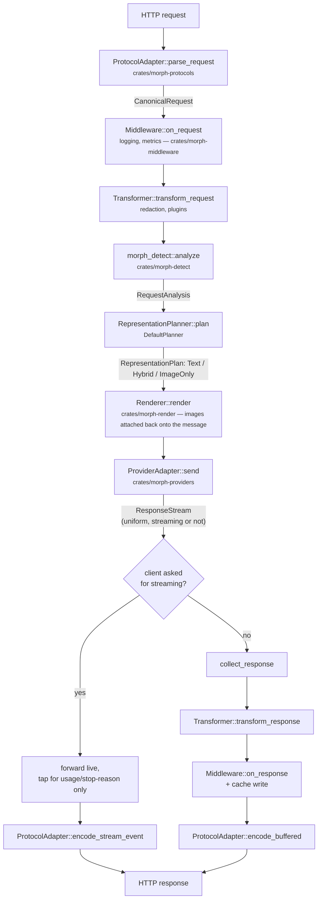

# Architecture

## Pipeline

Every arrow above is a stable trait boundary (`crates/morph-core/src/traits.rs`).
Adding a new provider, protocol, renderer, classifier, or transformer means
implementing one of these traits — nothing else in the pipeline changes.

## Crate layout

| Crate | Depends on | Role |
|---|---|---|
| `morph-core` | nothing | Canonical types (`CanonicalRequest`, `ResponseEvent`, ...) and every trait. No I/O. |
| `morph-config` | `morph-core` | TOML schema, hot reload via `notify` + `tokio::sync::watch`. |
| `morph-detect` | `morph-core` | Content classifiers (Markdown/code/JSON/YAML/XML/CSV/SQL/logs/tables/...) and the default heuristic `RepresentationPlanner`. |
| `morph-render` | `morph-core` | SVG/PNG rendering: Markdown, Code, JSON, Table, Log. Pure-Rust (`usvg`/`resvg`/`tiny-skia`/`syntect`), bundled fonts — no system font/cairo dependency. |
| `morph-providers` | `morph-core` | `OpenAiProvider` (generic OpenAI wire — covers most of the ecosystem) and `AnthropicProvider`. |
| `morph-protocols` | `morph-core` | `OpenAiChatProtocol`, `AnthropicMessagesProtocol`, `OllamaProtocol` — ingress adapters. |
| `morph-middleware` | `morph-core` | `LoggingMiddleware`, `MetricsMiddleware`, `RequestRecordingMiddleware`, `RedactionTransformer`, `ResponseCache`, `InMemoryStatsSink`. |
| `morph-plugin-abi` | `morph-core`, `wasmtime` | The WIT interface (`wit/plugin.wit`) plus generated host-side bindings — the single source of truth both the host and every guest plugin build against. |
| `morph-plugin-host` | `morph-plugin-abi` | Sandboxed WASM plugin loader/runtime: fuel limits, memory limits, locked-down WASI. Exposes plugins as ordinary `Renderer`/`Classifier`/`Transformer` trait objects. |
| `morph-gateway` | everything above | The axum HTTP server: routing, the pipeline, auth/rate-limit, `/health`, `/metrics`. |
| `morph-cli` | `morph-gateway` | The `morph` binary. |

## Why the canonical request/response types look the way they do

- **Every provider call is modeled as a stream of `ResponseEvent`s**, whether
  or not the provider natively streams. A non-streaming-capable backend's
  adapter just emits one synchronous burst of events. This decouples "does
  the client want streaming" from "does the provider support streaming" —
  `morph-gateway` decides independently whether to forward events live as
  SSE/NDJSON or buffer them into one JSON body, based on what the *client*
  asked for.
- **`DetectedContent::requires_exact_text()`** (JSON/YAML/XML/SQL/code/config)
  drives a hard rule in the default planner: for these kinds, the original
  text is *always* kept. An LLM's own vision-based transcription of an
  image is lossy for anything that needs to round-trip exactly, so an image
  is only ever an *additive* aid for structure recognition, never a
  replacement, for these kinds.
- **Code defaults to text-only**, even when vision-capable and even under
  `mode = "force_hybrid"`, unless `render.allow_code_as_image` is explicitly
  set. A coding agent needs precise, editable text; Morph must never
  silently degrade that by default.
- **Response transformers only run on the buffered (non-streaming) path.**
  Applying a transformer to a live token stream means either buffering it
  anyway (defeating streaming's latency benefit) or risking a pattern that
  spans a chunk boundary going unmatched. Streaming responses still get an
  observability hook (`pipeline::tap_stream`) that captures usage/stop-reason
  for logging/metrics without buffering the text itself.

## What's fixed at startup vs. hot-reloadable

`morph-gateway::build_app_state` assembles the *structural* pieces once:
which providers exist, which plugins are loaded, which middleware runs.
Adding a provider or a plugin needs a restart in v1.

What *is* live via `watch::Receiver<Config>`, re-read on every request: which
provider is `default_provider`, `mode`, `theme`, the render thresholds, and
the `cache`/`auth`/`rate_limit` enabled flags. Edit `morph.toml` while
`morph` is running and these take effect on the next request.

## Security posture

- No prompt/response content is logged by default (`logging.log_prompts =
  false`); only shape (message count, tokens, latency) is.
- WASM plugins run in a real sandbox: no filesystem access, no network
  access (`WasiCtxBuilder::new().build()` with nothing preopened or
  inherited), a fixed fuel budget (a runaway plugin traps instead of
  hanging — see `crates/morph-plugin-host/tests/example_plugin.rs`), and a
  fixed memory ceiling.
- Provider adapters are deliberately *not* part of the plugin surface —
  they hold API keys and make outbound network calls, so they stay native,
  reviewed Rust code rather than sandboxed guest code.
- `RedactionTransformer` scrubs common secret-shaped substrings
  (API keys, AWS keys, bearer tokens, emails) from both request and
  response content before it crosses the provider boundary — a best-effort
  safety net, not a substitute for not putting secrets in prompts.
